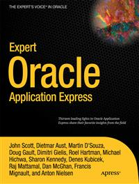

# Apress Source Code

This repository accompanies [*Expert Oracle Application Express*](http://www.apress.com/9781430235125) by John Scott, Doug Gault, Raj Mattamal, Anton Nielsen, Martin DSouza, Dimitri Gielis, Roel Hartman, Francis Mignault, Dietmar Aust, Michael Hichwa, Denes Kubicek, Dan McGhan, and Sharon Kennedy (Apress, 2011).

Download the files as a zip using the green button, or clone the repository to your machine using Git.

## Releases

Release v1.0 corresponds to the code in the published book, without corrections or updates.

## Contributions

See the file Contributing.md for more information on how you can contribute to this repository.
